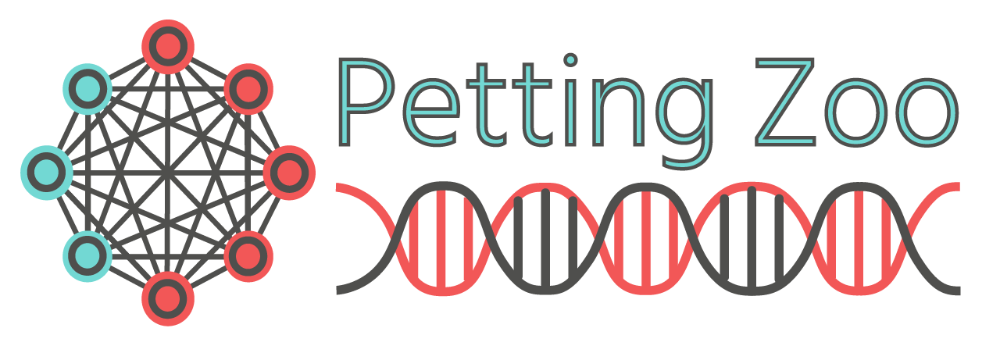
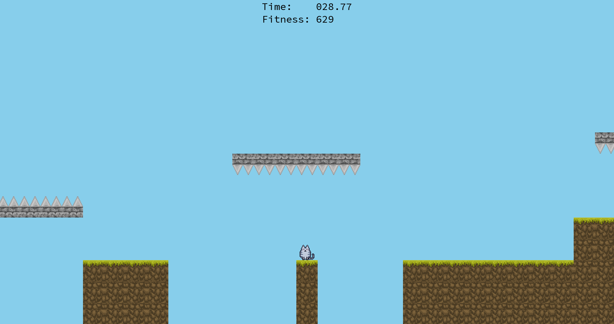
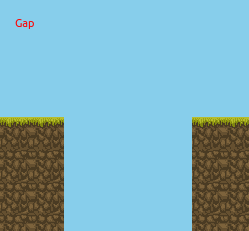
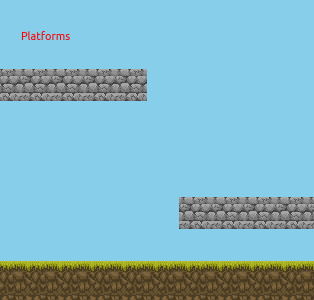
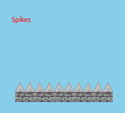
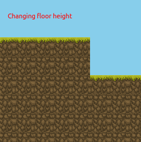

# Petting Zoo 

Petting Zoo is environment for machine learning models to frolic and learn in, and a framework to help them do it in parallel. Currently there are tools to train models with a genetic algorithm, and reinforcement learning tools are coming soon!

## The Environment

The models are trained to play a simple Mario-esque 2D platformer. All of the levels are procedurally generated, so the agents never run out of challenging levels to train on.



The following obstacles can be found in the levels:


- Gaps of varying width
- Platforms of varying types (normal, spikes upwards, and spikes downard)
- Changing floor height

 
 

Soon we will be adding flappy-bird style obstacles, and T-shaped platforms that connect to the ground. Models that *always* map the same input to the same output will need to learn to avoid these T-shaped platforms as once they go under the T, they wont be able to get out.

## The Genetic Algorithm

A [genetic algorithm](https://en.wikipedia.org/wiki/Genetic_algorithm) is an optimization technique inspired by the processes that brought about life on earth: natural selection and evolution. An initial *genertion* of agents is created, each with randomly initialized weights. All agents then play the same level, and are assigned a *fitness* value based on their performance. 

These fitnesses are then used to select *survivors* and *breeding pairs*. Survivors are simply agents that are not going to be "killed", and will have the opportunity to send their genes into the next generation. Survivors can be selected with a number of methods: taking the top half highest fitness, translating fitnesses to probabilities and sampling survivors from that distribution, etc.

Once survivors and breeding pairs have been chosen, they are combined together with a *genetic operator* and this creates a new generation of agents to evaluate. The process of repeatedly evaluating, selecting well-performing models, and breeding them together often results in agents that can play the game quite well.

### Why a genetic algorithm?

Well, supervised learning cannot be easily applied to games as you would need to be able to correctly identify which buttons to press at each frame and that is not an easy task. A genetic algorithm assumes nothing about the problem at hand--there is no surface to descent or conditional probabilities to calculate--the random combination and recombination of agents is all you need.

Maybe a better question is why are you using a genetic algorithm instead of reinforcement learning? Great question, we thought it would be fun and informative and soon we will be moving to reinforcement learning.

## The Models

Currently we have implemented feed forward deep neural networks (linear layers, biases, activations, and soon convolutional layers) and a strange pseudo naive-bayesian model. 

For an agent to work with our framework it should have the following class structure / attributes:

```Python
class Agent():
    def __init__(self, view_size, ..., generator=None):
        """ view_size: how large the player view is. Vector2 from the game module.
            generator: NumPy generator used to randomly initialize your model.
        """
        self.view = view_size
    
    def evaluate(x):
        """ x is a numpy array the size of self.view_size of the player view

            return a NumPy int/Bool array describing with buttons are pressed
        """
        pass
```

You also need to provide the code with a breeding function that takes in two parent agents and a numpy generator.
```Python
def breed_models(parentA, parentB, generator):
    """ Takes in two parent agents, combines them, and returns two new children"""
    pass
```

## Main Files

### `play_game.py`

This file will run the platformer and let you play.

### `run_genetic_algo.py`

This file is an example of how to train a model genetically. There's a lot that you can play with, especially when it comes to the method of choosing survivors and breeding pairs. Experiment with it and see what happens! 

The run logger in `run_genetic_algo.py` will create an output folder with a name of your choice, and write out various stats about each generation: min,max, and average fitness, how many completed the level, etc. It will also write out the best agent to disk using joblib. `./training/plot_run.py` can be used to plot the progress of a run, all you need to give it is the run output directory.

### `run_select_mutation.py`

This file is an example of training a model using mutation only. In each generation, the best model is chosen and the next generation is created by mutating that model randomly many times. The original model is also included in the new generation. 

### `watch_model.py`

`python watch_model.py [model_path]`

This will load in models dumped by the run logger and you can watch them play randomly generated levels. Takes an argument of model path. There are two pre-trained models included in this repository in the `/sample_models` directory.